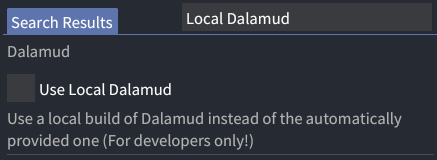

# Building Dalamud with MinGW

:::warning

This guide acts as supplementary information to the main
[Building Dalamud](/building/) page, and thus refers to steps from that page.

Dalamud's native components are maintained via Visual Studio. Those components
don't change often, which means it's much easier to skip the native build steps,
follow the dotnet (C#) build-steps only, and re-use the existing built binaries
with no drawbacks.

**As such, this _will_ break from time to time.** Fixes are welcome though!

:::

Dalamud is built using [Nuke](https://nuke.build), which lacks built-in
first-class support for Linux-supporting build systems. Specifically, as Nuke
only manages kickoff using other tools such as MSBuild and dotnet build, it
relies on that tooling to declare those projects with all their source files and
props.

In the case of Dalamud, the C / C++ projects use
[MSBuild `.vcxproj` files](https://learn.microsoft.com/en-us/cpp/build/walkthrough-using-msbuild-to-create-a-visual-cpp-project?view=msvc-170).
Those are very Visual Studio centric: It's trivial to do basic edits to them in
any text editor, but it's non-trival to find what VS toggle maps to the XML
syntax without using Visual Studio yourself.

## Building

### Build Prerequisites

- The base prerequisites from the main build page, except Windows and VS
- An x64 Linux environment, e.g. a 64-bit Linux OS on x64 hardware
  - This is not a hard requirement, but this page is written with this setup in
    mind.
- CMake
- MinGW x64 `x86_64-w64-mingw32`, either GCC or LLVM
  - If you prefer LLVM, unpack / symlink
    [llvm-mingw](https://github.com/mstorsjo/llvm-mingw) to
    `Dalamud/linuxtools/llvm/` and it'll be used.
  - The CMake toolchain falls back to `x86_64-w64-mingw32-gcc` in PATH if
    nothing else is found.

Optionally, if you want to run the CI / Test target, set up a Wine prefix with
the following:

- [.NET 10.0 SDK for Windows x64](https://dotnet.microsoft.com/download/dotnet/10.0)
- [Git](https://git-scm.com/downloads)

### Build Steps

Follow the main build steps, but instead of running the PowerShell script, run:

```bash
./build.sh
```

<sub>(Yes, even if you have PowerShell installed on Linux.)</sub>

:::tip

The Dalamud repository contains some basic VSCode configuration for debugging
various parts of the build process.

Follow the debugging steps below for more information.

:::

## Running

The build process will output the injector to `bin/Debug/Dalamud.Injector.exe`.
For testing purposes, you can follow the main page steps, or use the "Use Local
Dalamud" option in the XIVLauncher.Core settings.



## Debugging

A set of VSCode debugging default configurations is present, but the
configurations and prerequisites can be ported and reused to other debugging
environments, e.g. if you prefer using Ghidra as a gdb frontend.

### Debug Prerequisites

- [Samsung netcoredbg win64](https://github.com/Samsung/netcoredbg) in
  `Dalamud/linuxtools/netcoredbg/`
- [XIVLauncher.Core with PR 337](https://github.com/goatcorp/XIVLauncher.Core/pull/337)
  merged and **in PATH as `xlcore`** via a symlink, wrapper script, or similar.
- gdb, ideally compiled with support for `set osabi Windows`
- A symlink to the main .exe in `Dalamud/linuxtools/ffxiv_dx11.exe`
- DWARF debug symbols for the main .exe in
  `Dalamud/linuxtools/ffxiv_dx11.exe.dwarf`
  - For generating this, see
    [this patched version of ghidra-ExportDwarfELFSymbols](https://github.com/0x0ade/ghidra-ExportDwarfELFSymbols)
    for one possible method.

### Launch Configurations

- **Launch Wine netcoredbg Dalamud.Injector with winedbg:**<br> Launches
  `Dalamud.Injector.exe` with netcoredbg with arguments set to launch FFXIV with
  `winedbg` in `gdbserver` mode. Can be used to debug the injector and to
  quickly launch the game itself for basic debugging.

- **Attach to FFXIV via gdb on localhost:12345:**<br> Can be used in combination
  with the previous launch configuration. If you want to attach to a running
  full instance instead, use `xlcore wine taskmgr` and `xlcore wine winedbg` to
  attach to the Wine process ID for the game.

- **Launch build/build.csproj:**<br> Launches the NUKE build project. Can be
  used to debug the CMake generator.

- **CMake configure DalamudCrashHandler:**<br> Configures
  `Dalamud/build/cmakeprojs/DalamudCrashHandler` with a debugger attached. To be
  used after CMake project generation.

- **Launch winedbg Debug DalamudCrashHandler and attach gdb:**<br> Launches and
  attaches a debugger to `DalamudCrashHandler` with no arguments. Useful to
  verify that winedbg and gdb are functional.

If you prefer using tooling other than VSCode, check the arguments and steps for
those launch targets in the launch.json configuration file.

## ... but how?

### Why not move to \<insert build system here>?

Originally, building Dalamud with all its components required a full Windows +
Visual Studio setup, as the native components were heavily reliant on MSVC
compilation behavior. Even now, nearly all Dalamud development is happening on
Windows + Visual Studio. As such, a crazy member of the community though:

> I bet I can build this without moving away from .vcxproj and NUKE!

NUKE build recipes have full access to the
[MSBuild parser](https://github.com/dotnet/msbuild), which is written in C#,
open-sourced, MIT-licensed, available on NuGet, and used by NUKE itself. As
such, nothing stops us from parsing said .vcxproj files (or at least the subset
we need), generating CMakeLists out of those, and invoking the necessary CMake
commands to configure and build the project via NUKE.

### Quirks

MinGW does not support `#pragma comment` and `__try / __except` among other
things. Furthermore, header and library names are lowercase, and some parts of
std aren't being imported transitively as with MSVC, or don't support UTF-16
strings in the exact same way as MSVC.

Some are trivial to work around, such as `#pragma comment` and header
mismatches, while others require a bit more insight on how e.g.
`__try / __except` is used for SEH and doesn't map to normal C++ exception
handling by default.

Even if you don't have a Linux build environment, CI will flag most issues.

### Extensions

When the .vcxproj files get parsed, the property `IsMinGW` is set to `GNU` or
`Clang` to match
[CLANG_CXX_COMPILER_ID](https://cmake.org/cmake/help/latest/variable/CMAKE_LANG_COMPILER_ID.html).

`VCProjToCMakeLists` does not implement MSBuild targets. Any post-build steps
should be defined using the `CMakePostBuild` property with standard CMake
installation syntax instead.
